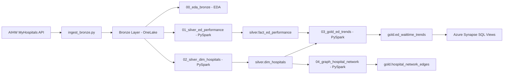

# WA Health ED Pipeline

A medallion architecture data pipeline on **Microsoft Fabric** processing Western Australian public hospital Emergency Department (ED) performance data.

Built to demonstrate real PySpark, Azure Synapse Analytics, and graph analytics skills using publicly available health data.

---

## Architecture



---

## Tech Stack

| Layer | Technology |
|---|---|
| Cloud platform | Microsoft Fabric |
| Storage | OneLake (Azure Data Lake Gen2), Delta Lake |
| Ingestion | Python + `azure-storage-file-datalake` (direct OneLake upload) |
| Transformation | PySpark (Fabric Notebooks) |
| SQL analytics | Azure Synapse Analytics SQL endpoint |
| Graph | PySpark graph modelling |
| Testing | Pytest |
| CI/CD | GitHub Actions |

---

## Data Sources

All data sourced from the **AIHW MyHospitals public REST API** — no authentication required.

| Endpoint | Description |
|---|---|
| `/measures/{code}/data-items` | ED performance values for all hospitals, all time periods |
| `/reporting-units` | Hospital names, coordinates, LHN (health service) mapping |
| `/datasets` | Dataset metadata — time period (start/end date) per `data_set_id` |

**AIHW Measures ingested:**

| Code | Measure | Type |
|---|---|---|
| MYH0005 | Percentage of patients departing ED within 4 hours | % |
| MYH0010 | Percentage commencing treatment within recommended time | % |
| MYH0011 | Number of ED presentations | Count |
| MYH0013 | 90th percentile ED departure time | Minutes |

**National target:** 67% for MYH0005. Hospitals below this are flagged as underperforming.

---

## Pipeline Stages

### Bronze Layer
Raw data as-is from AIHW API, uploaded by `scripts/ingest_bronze.py`:

| File | Records | Description |
|---|---|---|
| `bronze/aihw/measures/MYH0005/raw.json` | 37,185 | 4-hour departure rate, all hospitals |
| `bronze/aihw/measures/MYH0010/raw.json` | 22,532 | Treatment commencement rate |
| `bronze/aihw/measures/MYH0011/raw.json` | 22,678 | ED presentation count |
| `bronze/aihw/measures/MYH0013/raw.json` | 13,947 | 90th percentile departure time |
| `bronze/aihw/reporting_units/wa_hospitals.json` | 147 hospitals | WA hospital names, lat/lon, LHN mapping |
| `bronze/aihw/datasets/datasets.json` | 7,107 datasets | Time period lookup by `data_set_id` |

### Silver Layer
| Table | Description |
|---|---|
| `silver.fact_ed_performance` | WA hospital ED metrics — typed, WA-filtered, time periods resolved |
| `silver.dim_hospitals` | WA hospital dimension — name, location, health service (LHN) |

### Gold Layer
| Table | Description |
|---|---|
| `gold.ed_waittime_trends` | 4-hour rates with below-target flag, WA average, rolling avg |
| `gold.hospital_network_edges` | Graph edges: Hospital → HealthService |
| `gold.hospital_network_nodes` | Graph nodes: Hospital and HealthService entities |

### Synapse SQL Views
| View | Description |
|---|---|
| `vw_underperforming_hospitals` | Hospitals below the national 67% 4-hour target |
| `vw_wa_performance_summary` | WA-wide summary for the latest reporting period |
| `vw_health_service_ranking` | Health services ranked by average 4-hour rate |

---

## Notebooks

Run in this order in Fabric (`app.fabric.microsoft.com`):

| Order | Notebook | Stage | Output |
|---|---|---|---|
| 1 | `00_eda_bronze.ipynb` | EDA | Schema profiling, distributions, quality checks (no writes) |
| 2 | `01_silver_ed_performance.ipynb` | Bronze → Silver | `silver.fact_ed_performance` |
| 3 | `02_silver_dim_hospitals.ipynb` | Bronze → Silver | `silver.dim_hospitals` |
| 4 | `03_gold_ed_trends.ipynb` | Silver → Gold | `gold.ed_waittime_trends` |
| 5 | `04_graph_hospital_network.ipynb` | Silver → Gold | `gold.hospital_network_edges/nodes` |

All notebooks use absolute `abfss://` OneLake paths — no lakehouse attachment required.

---

## Quick Start

See **[RUNBOOK.md](RUNBOOK.md)** for the full reproducibility guide.

```bash
# 1. Clone and install
git clone https://github.com/david3xu/wa-health-ed-pipeline.git
cd wa-health-ed-pipeline
pip3 install -r requirements.txt

# 2. Authenticate
az login

# 3. Ingest bronze data → OneLake
python3 scripts/ingest_bronze.py

# 4. Run notebooks in Fabric (browser)
#    app.fabric.microsoft.com → wa-health-ed-pipeline workspace
#    Run: 00 → 01 → 02 → 03 → 04

# 5. Run local tests
pytest tests/ -v
```

---

## Development Workflow

Auto-sync notebooks to Fabric on every save:

```bash
python3 scripts/watch_and_sync.py
```

Manual sync:

```bash
python3 scripts/sync_to_fabric.py          # all notebooks
python3 scripts/sync_to_fabric.py 01       # notebook 01 only
```

---

## Project Structure

```
wa-health-ed-pipeline/
├── notebooks/
│   ├── 00_eda_bronze.ipynb               # EDA — bronze layer profiling
│   ├── 01_silver_ed_performance.ipynb    # Bronze → Silver: ED performance
│   ├── 02_silver_dim_hospitals.ipynb     # Bronze → Silver: hospital dimension
│   ├── 03_gold_ed_trends.ipynb           # Silver → Gold: ED trends + flagging
│   └── 04_graph_hospital_network.ipynb   # Silver → Gold: hospital graph
├── scripts/
│   ├── ingest_bronze.py                  # Fetch AIHW API → upload to OneLake
│   ├── sync_to_fabric.py                 # Push notebooks to Fabric via REST API
│   └── watch_and_sync.py                 # File watcher: auto-sync on save
├── sql/
│   └── views.sql                         # Synapse SQL views (run in Fabric SQL endpoint)
├── tests/
│   ├── conftest.py                       # Local SparkSession fixture
│   └── test_silver_quality.py            # Data quality assertions
├── .github/
│   └── workflows/
│       └── test.yml                      # CI: run pytest on push
├── RUNBOOK.md                            # End-to-end reproducibility guide
└── requirements.txt                      # Python dependencies
```

---

*Author: Jinguo (David) Xu | March 2026*
