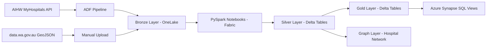

# WA Health ED Pipeline

A medallion architecture data pipeline on **Microsoft Fabric** processing Western Australian public hospital Emergency Department (ED) performance data.

Built to demonstrate real PySpark, Azure Synapse Analytics, and graph analytics skills using publicly available health data.

---

## Architecture



---

## Tech Stack

| Layer | Technology |
|---|---|
| Cloud platform | Microsoft Fabric, Azure Data Factory |
| Storage | OneLake (Azure Data Lake), Delta Lake |
| Transformation | PySpark (Fabric Notebooks) |
| SQL analytics | Azure Synapse Analytics SQL endpoint |
| Graph | PySpark graph modelling + Neo4j Cypher |
| Data sources | AIHW MyHospitals REST API, data.wa.gov.au |
| Testing | Pytest |
| CI/CD | GitHub Actions |

---

## Data Sources

| Source | Description |
|---|---|
| AIHW MyHospitals API | ED performance measures for all Australian hospitals |
| data.wa.gov.au | WA hospital locations, names, health service assignments |

**AIHW Measures used:**

| Code | Measure |
|---|---|
| MYH0005 | Percentage of patients departing ED within 4 hours |
| MYH0010 | Percentage commencing treatment within recommended time |
| MYH0011 | Number of ED presentations |
| MYH0013 | 90th percentile ED departure time |

---

## Pipeline Stages

### Bronze Layer
Raw data as-is from source:
- `bronze/aihw/measures/MYH0005/raw.json`
- `bronze/aihw/measures/MYH0010/raw.json`
- `bronze/aihw/measures/MYH0011/raw.json`
- `bronze/aihw/measures/MYH0013/raw.json`
- `bronze/wa_gov/hospitals/raw.geojson`

### Silver Layer
| Table | Description |
|---|---|
| `silver.fact_ed_performance` | WA hospital ED metrics, typed and validated |
| `silver.dim_hospitals` | WA hospital dimension — name, location, health service |

### Gold Layer
| Table | Description |
|---|---|
| `gold.ed_waittime_trends` | 4-hour rates with below-target flag, WA average, rolling avg |
| `gold.hospital_network_edges` | Graph edges: Hospital → HealthService |
| `gold.hospital_network_nodes` | Graph nodes: Hospital and HealthService entities |

### Synapse SQL Views
| View | Description |
|---|---|
| `vw_underperforming_hospitals` | Hospitals below the national 67% 4-hour target |
| `vw_wa_performance_summary` | WA-wide summary for the latest reporting period |
| `vw_health_service_ranking` | Health services ranked by average 4-hour rate |

---

## Notebooks

| Notebook | Purpose |
|---|---|
| `01_silver_ed_performance.ipynb` | Bronze → Silver: ingest & transform AIHW API data |
| `02_silver_dim_hospitals.ipynb` | Bronze → Silver: flatten WA hospital GeoJSON |
| `03_gold_ed_trends.ipynb` | Silver → Gold: join, flag underperforming, window functions |
| `04_graph_hospital_network.ipynb` | Silver → Gold: hospital network graph edges and nodes |

---

## Running Tests Locally

```bash
pip install pyspark==3.5.0 delta-spark==3.0.0 pytest
pytest tests/ -v
```

---

## Project Structure

```
wa-health-ed-pipeline/
├── notebooks/
│   ├── 01_silver_ed_performance.ipynb
│   ├── 02_silver_dim_hospitals.ipynb
│   ├── 03_gold_ed_trends.ipynb
│   └── 04_graph_hospital_network.ipynb
├── sql/
│   └── views.sql
├── tests/
│   ├── conftest.py
│   └── test_silver_quality.py
└── .github/
    └── workflows/
        └── test.yml
```

---

*Author: Jinguo (David) Xu | March 2026*
